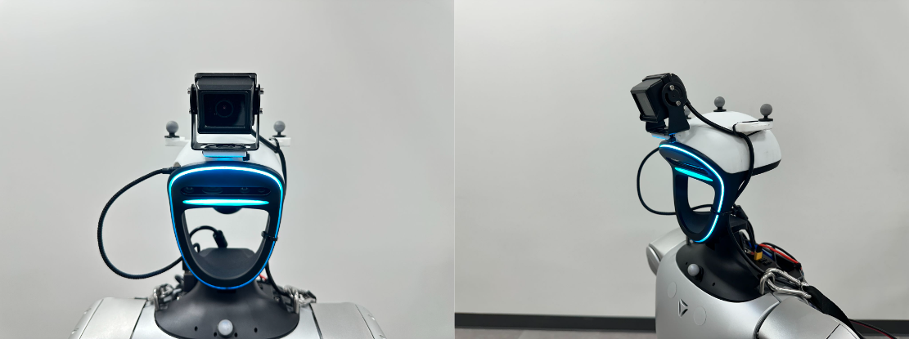

# G1 Localization 3 in 1 solution
This repository gathers 3 method for G1 robot localization
- Lidar SLAM via Fast-LIO2
- Optitrack Mocap system
- Vive ultimate tracker
## Run example
### Stream motion data
Please follow 1 of the 3 method to stream pose data
### Use G1 whole body pose
Based on G1's current joint angle and head pose, we can compute root pose via forward kinematics written in `pb_kinematics.py`

Here is an example using zero joint angle to obtain G1 whole body pose
```
python example.py
```

## 1. Mocap setup (With optitrack)
The goal of mocap is to provide global root pose, every mocap system have different setup method, here we provide an example of setting up mocap with optitrack system. **This method provide most accurate localization with least delay**.

### Making G1 sensor head mount
Please download 3D printing model [link](https://drive.google.com/file/d/10iMQRoimG9UdMBDX7EwtjR49ovosQ29T/view?usp=sharing)

We use camera from here: [link](https://www.amazon.com/Arducam-IMX291-Camera-Lightburn-Waterproof/dp/B0C36ZVQ5G/ref=sr_1_3?crid=22RBI1OPJZ2HS&dib=eyJ2IjoiMSJ9.tjF-ZakiDPD-LFtzpDjcmObPYvGui4JEY6W6viK7Liy6O6hFfWg2tLpFFA06UFcjNXV6SGAfbTFBthvoUP5VLUelUevX7-k1CPcz5KyxQ-kBssGc5vInbccC_zTaA5u6QtQdvsiwdIixGLWQXG67MmBEM8-CtkI1OQK4_AHXgTLjF6-f0Z6elbz8AmsuXG7iuVE3dzTfo62-WWVS6DJDZaCoQDQfFMuC3_CIycpEYfk.M3FUEfnCua7XZMtkMy3ZqvxDTR629S1rPVCmXRglvBU&dib_tag=se&keywords=arducam&qid=1754178360&sprefix=arducam%2Caps%2C234&sr=8-3)

After sticking markers and assemble camera, it should look like this:


### Config Motive on windows mocap server
Create rigid body asset in Motive align robot head with the mocap frame, and start streaming, please use Y-axis up convention make sure the server is in the same LAN as this computer. I found importing head mesh correspond to robot urdf into motive helpful for alignment.

### Stream mocap data via redis
Make sure redis server is running, if not
```
sudo systemctl stop redis-server
redis-server redis.conf
```

Broadcast head pose via redis, `--use_relative` will set world frame as initial x,y with z=0. You can also add `--visualize` flag to check whether humanoid pose looks correct or not.
```
python mocap_streamer.py --use_relative
```
## 2. FAST-LIO2
> This section is adapted from [FAST_LIO_LOCALIZATION_HUMANOID](https://github.com/deepglint/FAST_LIO_LOCALIZATION_HUMANOID) and [FAST_LIO_ROS2](https://github.com/Ericsii/FAST_LIO_ROS2)**This method provide least accurate localization with most delay, but work without any sensor or infrastructures**
### Install ROS2 (Humble)
### Install depending packages
```
pip install --upgrade "empy==3.3.4" lark-parser
pip install catkin_pkg
sudo apt install ros-humble-pcl-ros
```

### Build ROS workspace
```
cd ws_slam
colcon build --symlink-install
```

### Run Fast-LIO2 and Lidar Driver
In terminal one:
```
source install/setup.bash
ros2 launch fast_lio mapping.launch.py config_file:=mid360.yaml

```
In second terminal
```
source install/setup.bash
ros2 launch livox_ros_driver2 msg_MID360_launch.py
```

### Stream robot pose via redis
```
python lidar_streamer.py
```
## 3. Vive ultimate tracker
Vive ultimate tracker requires a windows laptop to obtain vive data and stream the pose info through redis
**This method is more accurate than Lidar slam when robot is moving within 5m relative to vive tracker's calibration center**
### Setup vive tracker
Please follow instruction from [DexCap](https://docs.google.com/document/d/1ANxSA_PctkqFf3xqAkyktgBgDWEbrFK7b1OnJe54ltw/edit?pli=1&tab=t.0) to setup vive tracker
### Prepare hardware
Please print a head cover to replace G1's default metal head cover [Model Link](https://drive.google.com/file/d/1tZZBsM8qcBd-GjI6JgoVLdn6zfnqqdrh/view?usp=sharing). When attaching vive tracker, please make sure that the light of vive tracker is facing forward. Polish may be needed if the vive tracker cannot lock into hooks of the 3D printed model.
### Run vive tracker streamer
After vive tracker has been setup, instead of running python code from DexCap, please run `vive_streamer.py`
```
python vive_streamer.py --use_relative
```

## Citation
```
@article{chen2025hand,
  title={Hand-Eye Autonomous Delivery: Learning Humanoid Navigation, Locomotion and Reaching},
  author={Chen, Sirui and Ye, Yufei and Cao, Zi-Ang and Lew, Jennifer and Xu, Pei and Liu, C Karen},
  journal={arXiv preprint arXiv:2508.03068},
  year={2025}
}
```
